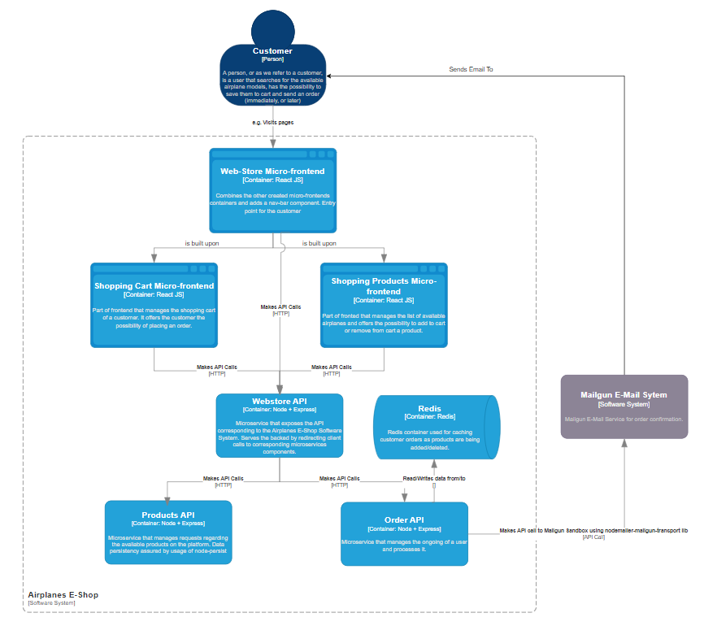
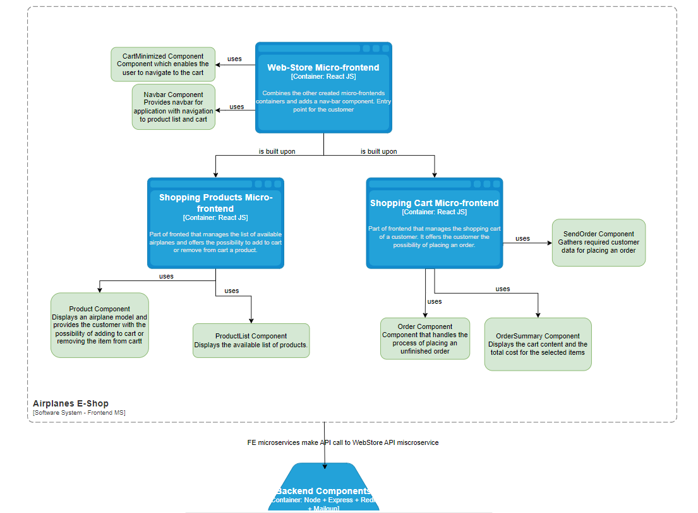

# Airplanes E-Shop - Software System

## 1. Before Running The Project
In order to run this project you firstly need to have docker and docker-compose installed on your machine. Besides this, you also need to setup Mailgun and provide the required values for `MAILGUN_DOMAIN`, `MAILGUN_API_KEY` and `MAILGUN_EMAIL` inside the docker-compose.yml configuration file. Once you did the above mentioned steps, you can move further and run the project.

## 2. Running the project

In order to run the project you need to be located in the root directory of the project and run the following command:

```
docker-compose up
```

## 3. System - Functionalities

The implemented software system is made for managing an online webstore that sell airplane models. The customer, has the possibility to view the available airplane models, add them to cart or remove if the case. For enhancing the user experience, the order is being cached based on the user IP, the on-going order being available for the user without the need of logging in and being available if accessing the application at a later time from the same machine (if IP did not change). 

## 4. System Architecture

The provided system uses microservices in order to enhance sustainability of the software system and is containerized using Docker and docker-compose for creating the application stack. The application stack is configured using the provided  `docker-compose.yml` configuration file and each project is being dockerized via the `Dockerfile` present in the root folder of each implemented microservice. The `docker-compose.yml` file is the following:

```
version: '3.8'

services:
  redis:
    container_name: redis
    image: 'redis'
    ports:
      - '6379:6379'
    volumes:
      - cache:/data
  orders-api:
    build: orders-api
    ports:
      - '8091:8091'
    environment:
      - PORT=8091
      - REDIS_URL=redis://redis:6379
      - MAILGUN_DOMAIN=someValueHEere
      - MAILGUN_API_KEY=someKeyCausWhyNot
      - MAILGUN_EMAIL=verySecretEmailAddress
    depends_on:
      - redis
  products-api:
    build: products-api
    ports:
      - '8092:8092'
    environment:
      - PORT=8092
  shop-api:
    build: webstore-api
    ports:
      - '8090:8090'
    environment:
      - PORT=8090
      - SHOPPING_PRODUCTS_URL=http://products-api:8092
      - SHOPPING_ORDERS_URL=http://orders-api:8091
    depends_on:
      - orders-api
      - products-api
  web-store:
    build: ./webstore
    ports:
      - '8080:8080'
    depends_on:
      - shopping-cart
      - shopping-products
  shopping-cart:
    build: ./shopping-cart
    ports:
      - '8081:8081'
  shopping-products:
    build: ./shopping-products
    ports:
      - '8082:8082'

volumes:
  cache:
    driver: local
```

As you can see above, we defined 7 services:
- 3 front-end related services 
- 3 back-end related services
- 1 3rd party service: Redis

### 4.1 System architecture overview - C4 Model



### 4.2 Frontend Components

The frontend of the application is built using the ReactJS library and is splitted in multiple microservices (`web-store`, `shopping-cart` and `shopping-products`) which are built using the micro-frontends pattern. We expose to the client one main entry point which is the `web-store` microservice, which further reuses components from `shopping-cart` and  `shopping-products`. In order to enable the usage of microfrontends, we use Webpack Module Federation Plugin. In this respect, each frontend project has a `.babelrc` configuration file and a `webpack.config.js` configuration file. In the `webpack.config.js` file we define what components we want to expose from the current project or what components we want to re-use from other projects. 

An overview over the exposed components is emphasized in the following figure:


