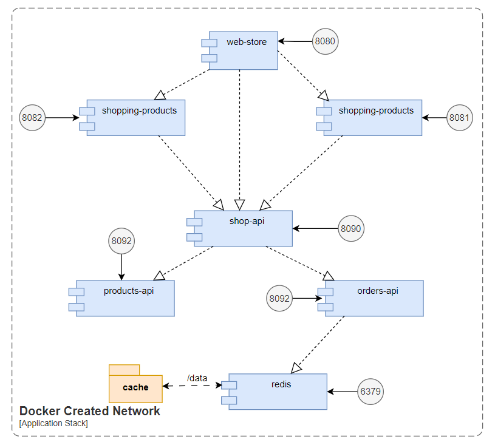
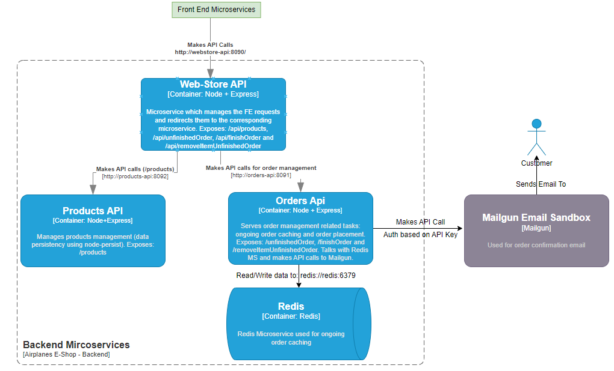
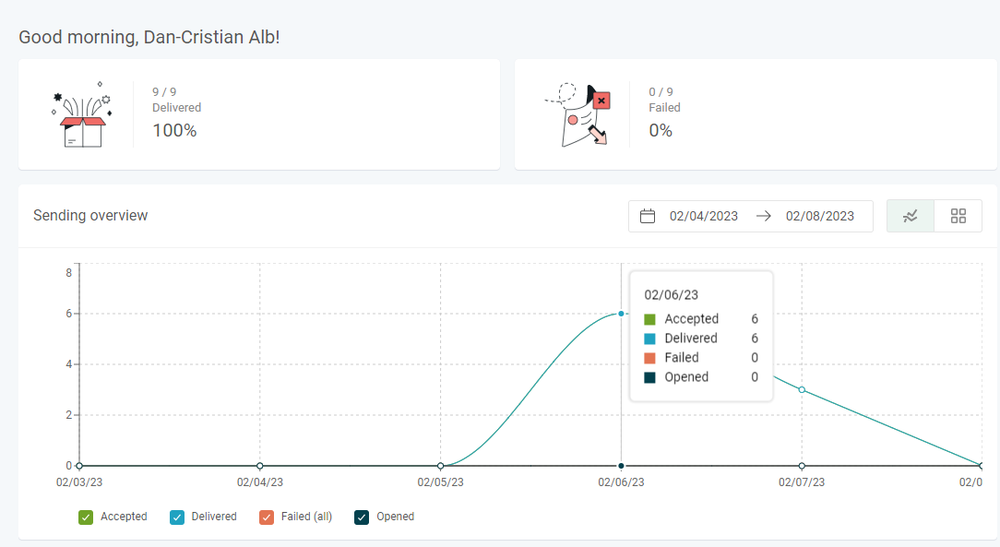
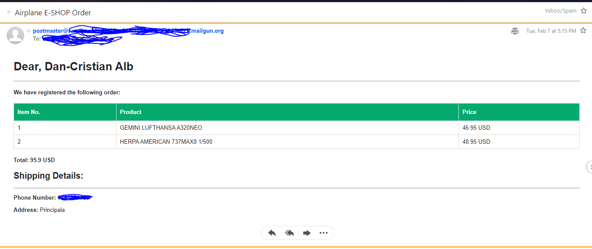

# Airplanes E-Shop - Software System

## 1. Before Running The Project
In order to run this project you firstly need to have docker and docker-compose installed on your machine. Besides this, you also need to setup Mailgun and provide the required values for `MAILGUN_DOMAIN`, `MAILGUN_API_KEY` and `MAILGUN_EMAIL` inside the docker-compose.yml configuration file. Once you did the above mentioned steps, you can move further and run the project.

## 2. Running the project

In order to run the project you need to be located in the root directory of the project and run the following command:

```
docker-compose up
```

## 3. System - Functionalities

The implemented software system is made for managing an online webstore that sell airplane models. The customer, has the possibility to view the available airplane models, add them to cart or remove if the case. For enhancing the user experience, the order is being cached based on the user IP, the on-going order being available for the user without the need of logging in and being available if accessing the application at a later time from the same machine (if IP did not change). 

## 4. System Architecture

The provided system uses microservices in order to enhance sustainability of the software system and is containerized using Docker and docker-compose for creating the application stack. The application stack is configured using the provided  `docker-compose.yml` configuration file and each project is being dockerized via the `Dockerfile` present in the root folder of each implemented microservice. The `docker-compose.yml` file is the following:

```
version: '3.8'

services:
  redis:
    container_name: redis
    image: 'redis'
    ports:
      - '6379:6379'
    volumes:
      - cache:/data
  orders-api:
    build: orders-api
    ports:
      - '8091:8091'
    environment:
      - PORT=8091
      - REDIS_URL=redis://redis:6379
      - MAILGUN_DOMAIN=someValueHEere
      - MAILGUN_API_KEY=someKeyCausWhyNot
      - MAILGUN_EMAIL=verySecretEmailAddress
    depends_on:
      - redis
  products-api:
    build: products-api
    ports:
      - '8092:8092'
    environment:
      - PORT=8092
  shop-api:
    build: webstore-api
    ports:
      - '8090:8090'
    environment:
      - PORT=8090
      - SHOPPING_PRODUCTS_URL=http://products-api:8092
      - SHOPPING_ORDERS_URL=http://orders-api:8091
    depends_on:
      - orders-api
      - products-api
  web-store:
    build: ./webstore
    ports:
      - '8080:8080'
    depends_on:
      - shopping-cart
      - shopping-products
  shopping-cart:
    build: ./shopping-cart
    ports:
      - '8081:8081'
  shopping-products:
    build: ./shopping-products
    ports:
      - '8082:8082'

volumes:
  cache:
    driver: local
```

As you can see above, we defined 7 services:
- 3 front-end related services 
- 3 back-end related services
- 1 3rd party service: Redis

Communication between the services is made via TCP using the docker created network for the stack. The ceated stack will have assigned a default network on the run of the `docker-compose up` command, which will persist for as long as we do not perform any prune type of commands. Each service will be available through the network at the specified port from the port mappings (that will be inside the docker created network, where we can access a service based on its name, but also to the outside in the hosting machine)

Bellow we also present a diagram presenting the containers, together with the inter-container dependencies:



In order to assure some data persistency for redis, we also added a volume (found under the name `cahce`) which will exist for as long as the created stack via the `docker-compose up` command exists.

### 4.1 System architecture overview - C4 Model


### 4.2 Frontend Components

The frontend of the application is built using the ReactJS library and is splitted in multiple microservices (`web-store`, `shopping-cart` and `shopping-products`) which are built using the micro-frontends pattern. We expose to the client one main entry point which is the `web-store` microservice, which further reuses components from `shopping-cart` and  `shopping-products`. In order to enable the usage of microfrontends, we use Webpack Module Federation Plugin. In this respect, each frontend project has a `.babelrc` configuration file and a `webpack.config.js` configuration file. In the `webpack.config.js` file we define what components we want to expose from the current project or what components we want to re-use from other project. 

As it can be deduced from the used technologies, our frontend follows a Single Page Applications (SPA) architercure combined with the use of micro-frontends. As for the general architectural structure, since we use micro-frontends we follow the following approach: the `web-store` microservice acts as the host application which further takes and integrates the components provided from the two micro-frontend components `shopping-products` (which handles logic for products) and `shopping-cart` (which manages logic for order). By using micro-frontends we can split the application logic in smaller chunks and enhance reusability of code, besides we can speed up the software development process by following this architectural pattern.

The application is built using a functional style, making use also of some basic React hooks, such as `useState` and `useEffect` hooks. To further enhance the propagation of changes in the exposed data, we use event listeners. As how this logic is implemneted: the component which changes an object will emit an event to inform other components that an update has been made. The components which use the modified data, have an event listener for that specific event, which gets triggered every time the event has been emitted and have an associated function which handles the logic for such an event. As for styling the components, we used minimal CSS and the Boostrap library.

An overview over the exposed components is emphasized in the following figure:


The services are being dockerized and exposed on the following ports:
- 8080 - `web-store`
- 8081 - `shopping-cart`
- 8082 - `shopping-products`


### 4.3 Backend Components

The backend is composed of 3 microservices, all of them are Node+Express applications and are used for managing the existing airplane models and managing on-going orders:
- `shop-api` on port 8090
- `orders-api` on port 8091
- `orders-api` on port 8092

An overview over the backend microservices and the communication between them is emphasized in the following figure



Our backend provided microservices follow an approach where the `shop-api` acts as the single entry point which assures the communication between the client and our provided REST services (`products-api` and `orders-api`). In this respect, `shop-api` is build following the logic of building an API Gateway pattern, handling the client requests and redirecting them to the suitable microservice that handles the requested action (we can see this microservice also as a router). Just like the other two microservices from our backend components, `shop-api` is a REST service which takes a request from the client, extracts the relevant data and further sends a request to the REST service which handles the requested action.

#### Third Party Software: Redis

We use Redis as a 3rd party service in order to enable the user with the possibility of storing an ogoing order based on the address from which a customer is accessing our portal. In this repsect, without the need of logging in, the user can easily have its order data saved so that a order that has been started now can be finished later, without the need of re-adding to cart the items previously added to cart.

At a networking level, clients use RESP (Redis serialization protocol) for communicating with Redis. Although it is not a rule, RESP uses the TCP protocol for communication as seen from the Network Layer level. The implemented model follows a Request-Response model, which can be translated as: once a client sends a request to Redis, a response for that request will be eventually send back from Redis.

#### Third Party Software: Mailgun

Once a customer placed an order, our software system is integrated with Mailgun for mail sending. We use Mailgun as it provides relevant information regarding the emails that have been sent. For instance, as it is presented in the bellow figure, we can see data regarding how many emails have been sent, or if there were any failures. 




Bellow we attached an image with the confirmation of an order made by a customer




